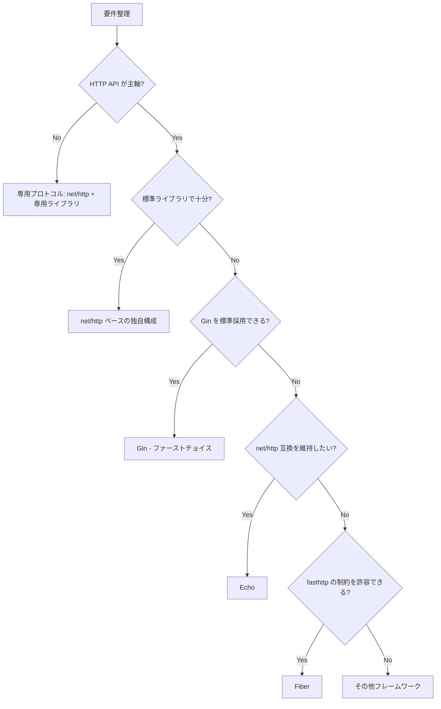

## 判断の前提

- 実行基盤: コンテナ常駐（Kubernetes、ECS、GCE 等）を中心に、一部は Cloud Run や Lambda (Go) などのサーバーレスも想定
- チーム構成: Go 経験の有無が混在し、SRE/インフラメンバーとの連携が密
- 特に重視する観点: レイテンシ/スループット、デプロイの確実性、可観測性

以下の問いを確認して候補を絞ります。

1. **API スタイル**: REST/gRPC/GraphQL のどれを中心に扱うか？
2. **性能要件**: P99 レイテンシやスループットに厳しい制約があるか？
3. **コードベースの規模**: マイクロサービス単位での小規模か、モノリス/モジュラー構成か？
4. **チームの流儀**: ミドルウェアより標準ライブラリを好むか、フレームワーク駆動で進めたいか？
5. **エコシステム連携**: OpenTelemetry、認証、バリデーションなどで既存ライブラリを多用したいか？

## 推奨候補

### Gin（ファーストチョイス）

| 観点           | 評価                                                                                      |
| -------------- | ----------------------------------------------------------------------------------------- |
| 生産性         | ルーティング、ミドルウェア、バリデーションをバランス良く提供し、DX と構造化を両立         |
| エコシステム   | 国内外で導入実績が多く、ドキュメントやハンズオンが豊富                                    |
| 運用性         | `net/http` 互換のため既存ミドルウェア・監視ツールを活用しやすく、SRE との連携も取りやすい |
| パフォーマンス | 軽量な実装で高パフォーマンスを維持、負荷試験のベンチでも上位                              |

#### 採用の目安

- REST API を中心に、チーム標準となるフレームワークを決めたい
- 学習コストを抑えつつ、一定のベストプラクティスが欲しい
- 既存サービスやテンプレートで Gin が採用されており、資産を流用したい

#### 避けたいケース

- gRPC や GraphQL が主役で、HTTP ハンドラが補助的な位置づけ
- フレームワーク非依存のクリーンアーキテクチャを徹底し、依存を極力排除したい

### Echo（net/http 互換の代替）

| 観点           | 評価                                                                         |
| -------------- | ---------------------------------------------------------------------------- |
| 生産性         | ルーティング／バリデーション／テンプレートを備え、Gin よりも構造化をサポート |
| エコシステム   | 社内外で採用例が多く、公式/コミュニティプラグインが充実                      |
| 運用性         | `net/http` 互換を維持しつつ、サーバー構成が明快で理解しやすい                |
| パフォーマンス | Gin と同等レベルで高速                                                       |

#### 採用の目安

- Gin との親和性はあるが、よりテンプレートやミドルウェアを重視したい
- Web UI と API を同居させるなど、Echo 独自の機能を活かしたい
- 組織内で Echo のアセットやナレッジが既に蓄積されている

#### 避けたいケース

- Gin ベースのプロジェクトが多数あり、標準化メリットを損ないたくない
- Gin Context との互換性を前提にしたライブラリを流用したい

### Fiber（高速特化・fasthttp ベース）

| 観点           | 評価                                                                          |
| -------------- | ----------------------------------------------------------------------------- |
| 生産性         | Express 風の API でシンプルに記述できるが、学習リソースは Gin/Echo より少ない |
| エコシステム   | 活発に拡大中だが、Gin ほどの導入実績はない                                    |
| 運用性         | `fasthttp` 依存のため `net/http` ミドルウェアはそのまま使えない               |
| パフォーマンス | Zero allocation を目指す実装でトップクラスのパフォーマンス                    |

#### 採用の目安

- P99 レイテンシやスループットに厳しい要件があり、fasthttp の制約を受け入れられる
- サーバー内の I/O が多く、パフォーマンスチューニングに十分なリソースを割ける
- Fiber の採用実績が既にあり、チームでノウハウを共有できる

#### 避けたいケース

- `net/http` ミドルウェアやライブラリを多数利用したい
- SRE/監視ツールが `http.Handler` 前提で構成されており、互換性を維持したい

### 標準ライブラリ (`net/http`)

| 観点           | 評価                                                                             |
| -------------- | -------------------------------------------------------------------------------- |
| 生産性         | ルーティングやバリデーションを自前で設計する必要があり、ボイラープレートは増える |
| エコシステム   | 最小依存の構成を好み、必要なものだけ選びたい場合に最適                           |
| 運用性         | 依存が少なく、長期運用やセキュリティアップデートに強い                           |
| パフォーマンス | Go の素の性能をそのまま引き出せる                                                |

#### 採用の目安

- 小〜中規模で、フレームワークに縛られずアーキテクチャを自分たちで設計したい
- gRPC やストリーミングなど、HTTP 以外のプロトコルとの並存を重視する
- SRE/インフラチームがコード全体を把握し、細かくチューニングしたい

#### 避けたいケース

- 立ち上げ速度や開発ベロシティを最優先したい
- Go 初学者が多く、ベストプラクティスを示す枠組みが必要

### Buffalo / Go-Kit などフルスタック系

- モノリシック構成やレイヤリングを重視する場合に検討
- ただし学習コストが高く、コミュニティ規模も限定的なため、チーム合意が必須

## 選択フロー例

## 補助ツール

- Config: Viper, envconfig, koanf
- ORM/Query: GORM, sqlc, ent
- テスト: GoConvey, testify, httptest, pact-go
- 観測: OpenTelemetry-Go, Prometheus client_golang, Jaeger
- タスクランナー: Mage, Taskfile

## ドキュメント/リンク

- [Gin Web Framework](https://gin-gonic.com/docs/)
- [Echo Web Framework](https://echo.labstack.com/guide)
- [Fiber Documentation](https://docs.gofiber.io/)
- [Go net/http Package](https://pkg.go.dev/net/http)
- [Go Best Practices (Uber)](https://github.com/uber-go/guide)
