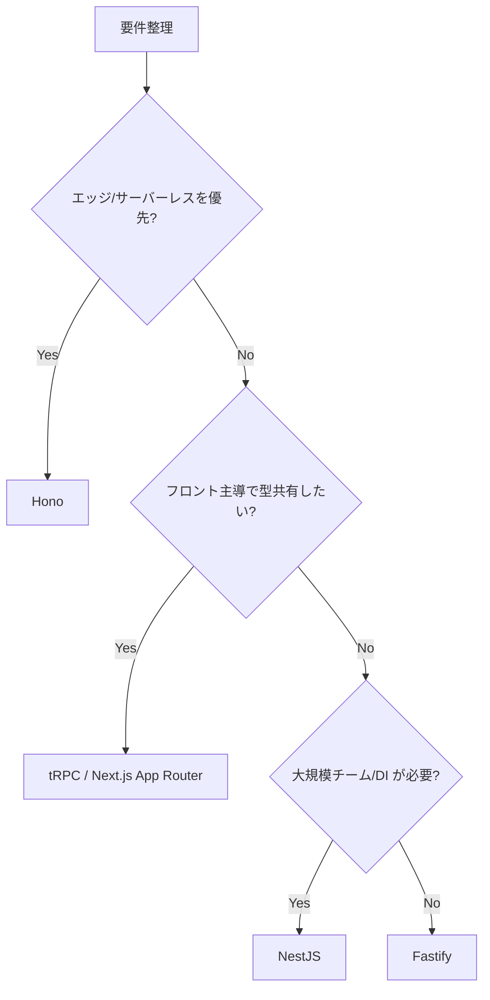

## 判断の前提

- 実行基盤: Node.js (LTS) / Bun / Deno などを含む JavaScript ランタイム
- インフラ: サーバーレス（Vercel、Cloudflare、AWS Lambda 等）とコンテナ常駐（Kubernetes、ECS 等）の両方を想定
- チーム構成: フロントエンド兼任〜専任バックエンドまで混在

まず以下の問いに Yes/No で答え、候補を絞ります。

1. **API スタイル**: REST / RPC / GraphQL の何を主に提供するか？
2. **運用環境**: コールドスタートやエッジ実行を意識する必要があるか？
3. **チームの好み**: フルスタック型か、OOP/DI を含むサーバーサイド経験が豊富か？
4. **型安全性要求**: API スキーマと型定義を一貫させたいか？
5. **ミドルウェア連携**: ORM、認証、ジョブキューなどの既存資産との親和度は？

## 推奨候補

### Hono（ファーストチョイス）

| 観点           | 評価                                                                                |
| -------------- | ----------------------------------------------------------------------------------- |
| 生産性         | ルーティング/API 定義が最小限で、型推論が効く DX を提供                             |
| エコシステム   | Cloudflare Workers、Bun、Node.js など複数ランタイムで動作し、公式ミドルウェアも充実 |
| 運用性         | Edge/サーバーレス向けに最適化されており、コールドスタートが極めて速い               |
| パフォーマンス | ベンチマーク上位で、マルチランタイムでも高スループットを維持                        |

#### 採用の目安

- エッジ実行（Cloudflare Workers、Bun、Deno、Lambda@Edge 等）を第一候補にしたい
- REST / RPC API をシンプルな構造で提供し、初期立ち上げ速度を重視する
- 軽量ながらもミドルウェアやバリデーションを柔軟に組み合わせたい

#### 避けたいケース

- OOP/DI ベースのレイヤードアーキテクチャが既に確立されている
- GraphQL や複雑なバッチ処理など、抽象化やコード生成が必要な要件が多い
- 実行環境がオンプレ常駐で、Node.js 固定かつ既存フレームワーク標準が存在する

### NestJS

| 観点           | 評価                                                                       |
| -------------- | -------------------------------------------------------------------------- |
| 生産性         | DI、モジュール構成、コードジェネレーターにより大規模開発でも構造化しやすい |
| エコシステム   | TypeORM、Prisma、GraphQL、CQRS など公式サポートが豊富                      |
| 運用性         | CLI でのスケルトン生成、設定一元化でチーム標準化しやすい                   |
| パフォーマンス | ミドルウェアレイヤーが厚いためハイパフォーマンス用途では調整が必要         |

#### 採用の目安

- サービス規模が中〜大で、OOP/DI に慣れたメンバーがいる
- 認証、バッチ、マイクロサービス等の機能セットを素早く揃えたい
- Spring Boot ライクな体験を TypeScript で再現したい

#### 避けたいケース

- 極限までレイテンシを削りたいエッジ API
- ランタイム制限が厳しく、バンドルサイズや初期化コストを抑えたい場合

### Fastify

| 観点           | 評価                                                                |
| -------------- | ------------------------------------------------------------------- |
| 生産性         | Schema ベースでルーティングとバリデーションを構成しやすい           |
| エコシステム   | プラグインエコシステムが充実し、`@fastify/*` で多くの周辺機能に対応 |
| 運用性         | JSON Schema を用いた型推論により、OpenAPI 連携も容易                |
| パフォーマンス | Node.js フレームワークの中でもトップクラスに高速                    |

#### 採用の目安

- REST API 中心で、低レイテンシと型安全性を両立したい
- NestJS ほどの抽象化は不要だが、規模が中程度まで伸びる想定がある
- サーバーレスやエッジ環境にデプロイし、コールドスタートを抑えたい

#### 避けたいケース

- GraphQL や WebSocket を中心とした複雑なアプリケーションで、公式プラグイン範囲を超える
- OOP ベースの DI コンテナなど既存思想と大きく乖離しているチーム

### tRPC / Next.js App Router

| 観点           | 評価                                                    |
| -------------- | ------------------------------------------------------- |
| 生産性         | サーバーとクライアントの型共有による DX が極めて高い    |
| エコシステム   | Next.js や Vite ベースのフルスタック構成と相性が良い    |
| 運用性         | サーバーレス / エッジに最適化されており、デプロイが容易 |
| パフォーマンス | 軽量で、用途に応じてバンドルを最適化できる              |

#### 採用の目安

- フロントエンド主導で BFF を構築し、型の崩壊を避けたい
- モノレポでサーバー・クライアントを統合管理しやすい体制がある
- GraphQL ほどの柔軟性は不要で、RPC の DX を重視する

#### 避けたいケース

- 公開 REST API を第三者に提供するなど、言語非依存のプロトコルが必須
- 長期運用でフロントエンドとバックエンドを分離部署が担当する組織構造

## 選択フロー例

## 補助ツール

- ORM: Prisma（型安全 かつ複数 DB 対応）、Drizzle（軽量）
- テスト: Vitest / Jest、Supertest、MSW
- ジョブキュー: BullMQ、Temporal（TypeScript SDK）
- 観測: OpenTelemetry SDK、Sentry、Datadog

## ドキュメント/リンク

- [NestJS Docs](https://docs.nestjs.com/)
- [Hono Docs](https://hono.dev/)
- [Fastify Documentation](https://www.fastify.io/docs/latest/)
- [tRPC Docs](https://trpc.io/docs)
- [Prisma Documentation](https://www.prisma.io/docs)
